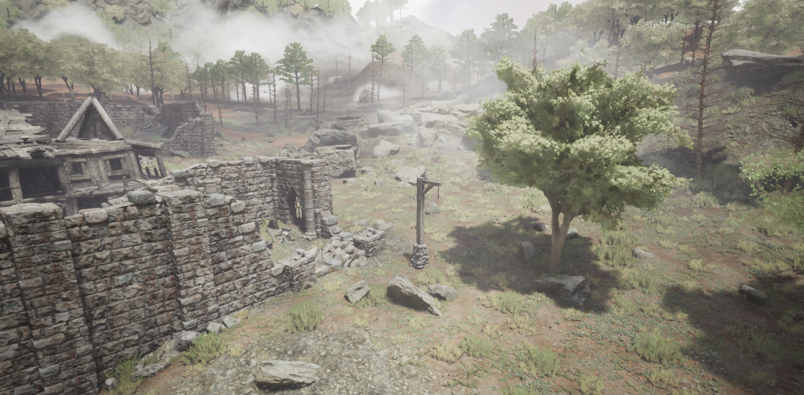
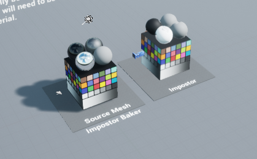
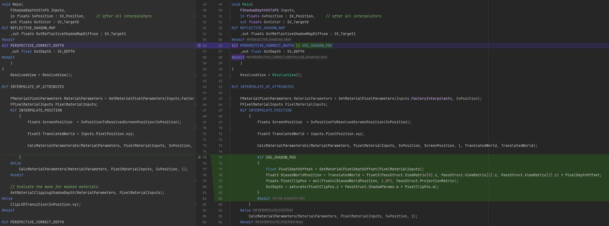
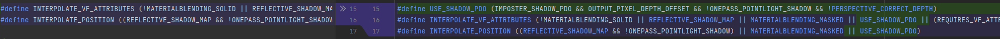
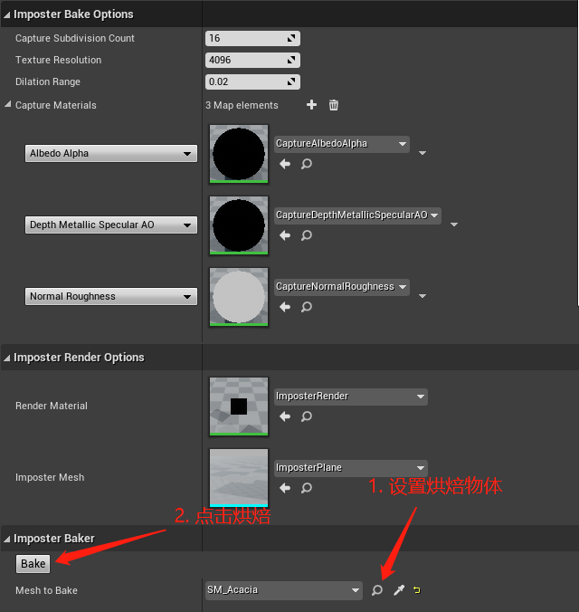
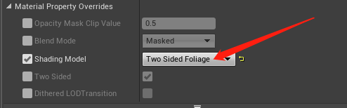
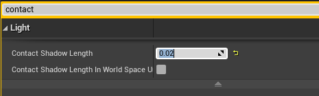

# Imposter动态阴影

# 效果

动态阴影，左边为imposter，右边为原模型。

各个视角观察：

普通物件：

# 参考
- 主要参考现有的比较接近的做法，octahedral imposter：
    https://github.com/ictusbrucks/ImpostorBaker
    - 可以参考的另一个版本：https://github.com/GavinKG/ImposterGenerator

- 此外还参考了原作者的几篇相关博客：
    - 关于octahedral imposters：https://shaderbits.com/blog/octahedral-impostors
    
    - 关于dilation： https://shaderbits.com/blog/uv-dilation
    
    - 关于sdf生成： https://shaderbits.com/blog/various-distance-field-generation-techniques
    
      

# 功能简述
- 问题 ：billboard的阴影 + 不同角度观察能正确显示

- 现有的imposter做法效果已经非常好，足以应付大多数物件，可惜不支持阴影，因此不适合用于烘焙植被，此外还有一些不支持金属、粗糙度、ao的小问题。

- 

- 在现有开源octahedral imposter的基础上加入了阴影支持（包括接受阴影和产生阴影）。

- 没有直接在插件上修改，参照插件中的蓝图和材质重新实现了一份impostor烘焙，功能没有原插件完善，但完全用c++和hlsl编写，更加易读，c++代码与shader代码均不超过300行。

- 主要实现的功能点包括：
  - bake过程。
  - imposter渲染。
  - 采多个视角插值，防止旋转与跳变。
  - 各个通道的dilation。
  - alpha通道生成距离场。
  - 正确写入场景深度，可以结合contact shadow产生细碎的阴影。
  - 利用深度进行简单的视差矫正。
  - 正确渲染shadowmap。
  
- 阴影
  
  阴影没有使用bake单个方向的阴影来实现，而是根据需求做成了动态的，做法是在shadowmap pass时渲染朝着光源方向的imposter，正常写入深度，然后渲染时用不透明或alpha test材质正确写入场景深度，这样就能实现正确的shadow渲染。
  此外，shadowmap精度在远处较为一般，适合搭配contact shadow使用，ue本身提供了contact shadow，这里就没有再自己实现一份，直接在光源设置中打开即可。
  
  

# 使用方式与代码位置

### **插件安装**
参照了网上各种ue工具的实现方式，烘焙工具主体部分以插件的形式实现，将 *Source/Plugins/ImposterBaker* 目录拷贝到项目或者引擎的Plugins文件夹下，在引擎插件中启用即可使用。

### **引擎源码修改**
由于修改了引擎源码，需要将Source/Shader/目录下的文件拷贝到引擎中使用。

如果不需要shadowmap，只使用contact shadow来实现细碎的叶子阴影，可以不需要改引擎源码，但是如果要实现正确的shadowmap阴影，不得不修改引擎源码，因为4.26默认是只对base pass实现了pixel depth offset，对shadowmap没有效果，而我们的imposter深度写入主要是通过pixel depth offset，因此需要添加shadow pass对pixel depth offset的支持。

将Source/Shader/目录下的文件拷贝到引擎中即可，本人使用的引擎是4.26.1，如果版本不同，可能会导致其他功能损坏，以防万一，这里给出与原文件的diff作为参照，只修改了几行代码。

Engine\Shaders\Private\ShadowDepthPixelShader.usf文件，添加shadowmap对pixel depth offset的支持：

Engine\Shaders\Private\ShadowDepthCommon.ush文件，在对应行修改一下宏。

### **示例场景**

插件的Example/目录下有一个示例场景，注意ue的加载策略可能导致imposter显示结果过于模糊，可能是贴图没加载完全，可以打开Example/ImposterOutput/目录，这样就能看到清晰的场景。

场景中已经放置了一个baker，可以将任意模型拖入场景里烘焙。

### **工具使用方式**

**1. 烘焙**

将插件的Blueprint/目录下的ImposterBakeProxy拖到场景中，detail面板有对应配置，默认已经有一套可以直接使用的配置，直接选择物体烘焙即可：

烘焙完成后，场景中会在原模型旁边自动出现一个imposter，材质与贴图的输出路径默认是在Content/ImposterOutout/下。

**2. (可选) 修改shading model**

自动生成的imposter是默认pbr材质，如果是给植被用，可以考虑改成two sided foliage。

生成的材质是material instance，母材质是插件目录下的ImposterRender材质，在material instance下方可以修改shading model，如下：

**3. 打开主光源接触阴影**

shadowmap的精度较难支撑叶子间细碎的阴影，选择场景中的directional light然后在detail面板中搜索contact shadow，然后将距离调整为0.01~0.02就可以看到叶子间的阴影。

开关contact shadow的对比：

### **代码位置**

插件代码的c++端所有逻辑都在ImposterBakeProxy.cpp中，其他文件都是创建插件时生成的，并不包含Imposter Baker的逻辑。

主要逻辑在AImposterBakeProxy::Bake，内容基本上是参照epic的octahedral imposter开源的版本来实现的。

shader都在Material/目录下，包含了三个烘焙材质和一个渲染材质，三个烘焙材质分别是用来bake三张贴图的，ImposterRender材质则是用来渲染Imposter的，几个材质球完全使用hlsl来实现。

# todo
octahedral imposter的开源实现也还存在许多缺陷，由于工期较短，工作的主要内容集中在添加光影支持上，还有许多工作尚未完成，以下列出一些已知的缺陷和改进方向：
- bake某些植被的时候会有色差，但是大多数普通物件没有色差，github上的插件也有这个问题，在bake树叶颜色较为杂乱的树时尤为明显，尚未定位到原因，可能是低分辨率bake的植被无法完整表达树叶上的高频细节。
- 因为做了对相机的位置偏移，靠太近观看容易被近平面裁剪掉。
- 距离过远超出shadowmap范围就会没有阴影，这一点上不如将阴影bake死的版本，可以考虑远处使用contact shadow代替，只需要正确写入深度即可。
- 只支持了directional light，其他local light尚未支持，会出现阴影计算错误。
- 树干和树叶都是用的同一个shading model，没有预先bake shading model mask。
- 还可以额外支持下树叶飘动效果。